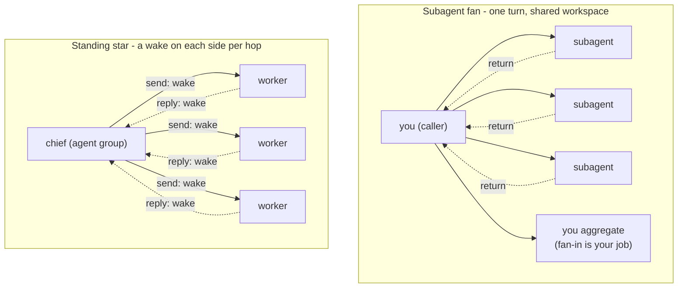

# Multi-agent patterns

Every canonical pattern here has two realisations: a cheap one in **subagents** - one turn, a shared workspace mount, aggregation by return value - and an expensive one in **standing agents** - a wake per hop on each side, reachable only along destination rows and holdable by a message policy on the pair, star-shaped by default, no ack. Standing each node up is itself held for admin approval unless your `cli_scope` is `global`. You pay for the standing version only to buy persistence, addressability, off-turn scheduling or a real isolation boundary, never for role aesthetics.

This file settles topology: which substrate realises the shape, and the costume test for when the named pattern collapses into a cheaper thing. How a fixed-topology run then executes - pass count and cap, the return contract, fan width, who writes state - is `loop-design`'s, and each entry links there rather than restating it.

## Contents

- The two substrates
- Chain
- Router
- Fan-out / fan-in
- Reflect-and-critique
- Consensus / debate

## The two substrates

*The same fan shape twice: cheap when returns land in your turn, expensive when every hop is a wake and the workers cannot reach each other.*

**Subagent fan**: in-turn. Each subagent returns once, into this turn, and shares your workspace mount, so parallel writers race and one wins silently (aggregate by return value, or give each its own filename). Nobody aggregates for you: fan-in is your job. **Standing agents**: separate workspaces, nothing shared. Each exchange is a wake on both sides, with no ack, so a crashed node and a thinking one look identical. Destinations are the access list, and a send is held only where a message policy sits on the pair, not by default. Standing the agents up at all (`create_agent`, `spawn_topic_agent`) writes the central DB, so *that* call is held for admin approval unless your `cli_scope` is `global`; `spawn_topic_agent` goes one level only.

## Chain

*Anthropic name: prompt chaining.*

- **What it is.** A pipeline where each stage consumes the previous stage's *output*, not its context: parse, then extract from the parse, then summarise the extract. Cheap only because the handoff is small by construction.
- **NanoClaw realisation.** Inline stages, or one subagent per stage in a single turn. Never standing agents: a standing pipeline re-transfers the built context at every hop, which is the role-split mistake Step 1 warns against (planner, then implementer, then tester as separate agents).
- **Cost.** One in-turn subagent call per stage. The whole economy rests on the handoff staying small; if a stage has to re-read what the last stage read, it was never a chain and you paid for a split that bought nothing.
- **Worth it when.** The task decomposes into fixed stages whose handoff is genuinely small.
- **Costume for.** A single inline pass, when the stages actually share most of their context - then it is one job cut up, not a chain.
- **Failure mode.** A stage re-reads the previous stage's inputs, so the handoff is not small: cost with no benefit.
- **Reconciles.** SKILL.md Step 2 already names this inline; this entry restates it as topology. Who runs the stages and how is `loop-design`'s.

## Router

*Anthropic name: routing.*

- **What it is.** Classify the input and dispatch it to a specialised followup, for separation of concerns and tighter per-branch prompts.
- **NanoClaw realisation.** There is no live-dispatch primitive. The cheapest router is one agent picking a skill or a subagent brief by the request: a planning brief decomposes and returns a plan, and the caller is the router that reads it and picks each specialist. Routing among standing agents means each dispatch is a `send_message`, a wake on each side, and the router must already hold a destination row (the ACL) to every target.
- **Cost.** Subagent or skill routing: one turn, near-free classification. Standing routing: two wakes per dispatched branch, and the router holds the correlation itself, with no ack to tell it a branch went quiet.
- **Worth it when.** Distinct categories genuinely better handled by different specialists, and the classification is reliable. Among standing agents, only when the branches are already standing concerns for other reasons: never spin agents up to be routing targets.
- **Costume for.** Skill or subagent-brief selection. Routing-to-standing-agents is usually that cheaper in-turn pick wearing a costume: you paid a classification hop and a wake for what choosing a brief does inside one turn.
- **Failure mode.** The categories are not truly distinct, so you paid a classification hop for nothing.
- **Reconciles.** The genuinely new entry, with no inline name today. A planning subagent (Step 2) decomposes but does not dispatch: it returns a plan, the caller routes.

## Fan-out / fan-in

*Anthropic names: parallelisation (sectioning) and orchestrator-workers.*

- **What it is.** Split into parallel pieces, aggregate the outputs. Sectioning = the pieces are pre-known and fixed; orchestrator-workers = the orchestrator decides the pieces at runtime. Same NanoClaw shape either way.
- **NanoClaw realisation.** Two rows. As **subagents**: a fan in one turn, each returning a finding, you holding the running answer - *"read these six adapters and report which declare channel defaults"* - fan-in is your job, nobody aggregates for you. As **standing agents**: the chief-and-workers star, a destination per worker, workers unconnected to each other, each report an inbound wake.
- **Cost.** Subagent fan: N model and tool costs in one turn, aggregate by return value; but parallel subagents writing the same path on the shared mount race and one wins silently, so return findings or give each its own filename. Standing star: N workers, each a wake on both sides per hop, reachable only along destination rows and holdable by a message policy, with no ack to distinguish a crashed worker from one still thinking; standing each worker up is held for admin approval unless your `cli_scope` is `global`.
- **Worth it when.** The subagent fan whenever the facets are independent and their context can stay out of your head. The standing star only when the workers are genuine standing concerns with their own chats, memory and schedules: the Step 1 outlive-the-turn warrant, not the shape.
- **Costume for.** The standing chief-and-workers star is a subagent fan-out wearing a costume whenever the workers exist only to serve this request - the verdict SKILL.md's `### Chief and workers` already reaches, tied here to the canonical orchestrator-workers name.
- **Failure mode.** Parallel subagents clobber a shared file, one wins silently; a standing worker goes quiet and nothing tells you.
- **Reconciles.** SKILL.md `### Chief and workers` is the standing row. Fan width, the return contract and who writes state are all `loop-design`'s.

## Reflect-and-critique

*Anthropic name: evaluator-optimiser.*

- **What it is.** One mind drafts, a *different* mind evaluates and feeds back, iterate to a nameable exit. Identical to the skill's existing generate-then-critique loop: the same pattern, not a new label.
- **NanoClaw realisation.** Subagents: a drafter plus a separate critic, briefed by what the critique is *about* - a refuter (could the conclusion be wrong; it never saw how the draft was made), a fact-checker (is the claim true), a verifier (does the artefact meet criteria stated in advance). Almost never standing: a critique that returns into your turn is by definition a subagent, so Step 1 keeps it off the standing tier.
- **Cost.** Two-plus in-turn calls. The critic must not be the drafter and must not have seen the draft's making: that blindness is the whole reason the second call exists. As standing agents each loop is two wakes and the draft travels by message, which is rarely warranted.
- **Worth it when.** Clear evaluation criteria and iterative refinement that buys measurable value. Name the exit condition and the iteration cap before you start; "until it is good" runs forever.
- **Costume for.** If the drafter grades its own work, it is a single pass pretending to be a loop. The pattern exists only to stop that.
- **Failure mode.** No nameable exit criterion, so it loops forever.
- **Reconciles.** SKILL.md Step 2's generate-then-critique loop. Pass count, the cap, and what counts as a real check are `loop-design`'s ("The check has to be able to fail").

## Consensus / debate

*Anthropic name: parallelisation (voting).*

- **What it is.** Run the same question N ways for diverse outputs, then aggregate or tally. Voting = independent one-shot attempts, then count; debate = voting plus argument across rounds.
- **NanoClaw realisation.** Subagents: N on the same prompt, you tally - but subagents cannot talk to each other mid-run (they return once), so a subagent "debate" is really one round of independent votes. True back-and-forth needs standing agents: a wake per utterance per side, no shared transcript (one writer per workspace), replies landing in finish order not send order, any message holdable for approval.
- **Cost.** Subagent voting: N times one turn's spend, cheap, same shared-mount race (return findings, or one file each). Standing debate: three round trips to converge is three wakes on each side, and there is no voting or quorum primitive, so the chief tallies manually with no crashed-versus-thinking signal.
- **Worth it when.** A high-stakes or noisy judgement where several independent attempts raise confidence, as a subagent vote. Almost never as a standing debate.
- **Costume for.** The most costume-prone pattern: standing-agent debate is a subagent vote wearing a costume, paying a wake per round for cross-talk that subagents get free by all returning into one turn. Overkill entirely for anything with one deterministic answer: you pay N times for one result.
- **Failure mode.** A deterministic single answer routed through a vote; or a standing debate whose fan-in is manual and whose held replies vanish silently.
- **Reconciles.** Tally mechanics and the return shape are `loop-design`'s.
